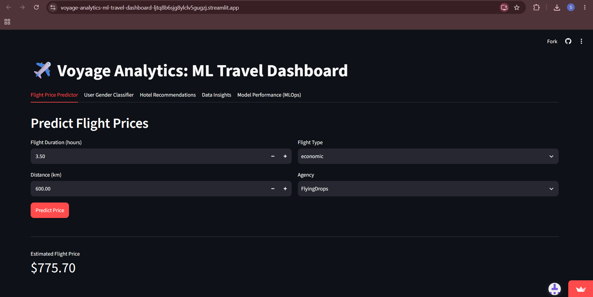
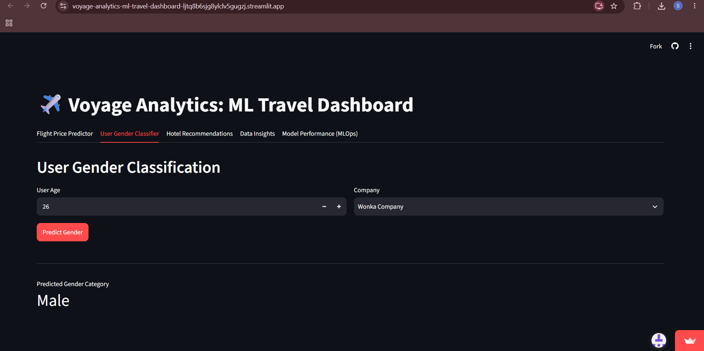
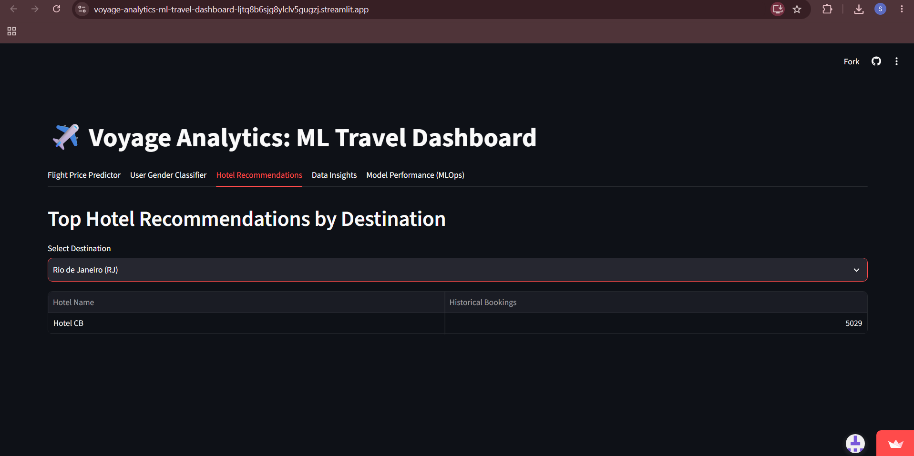
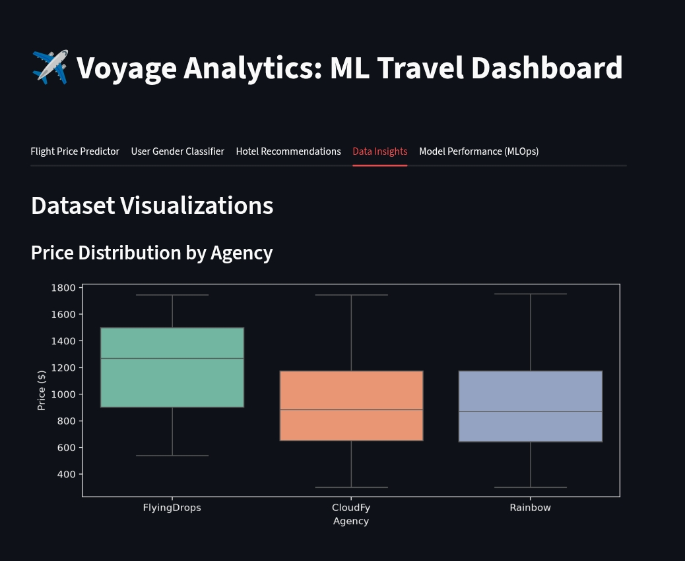
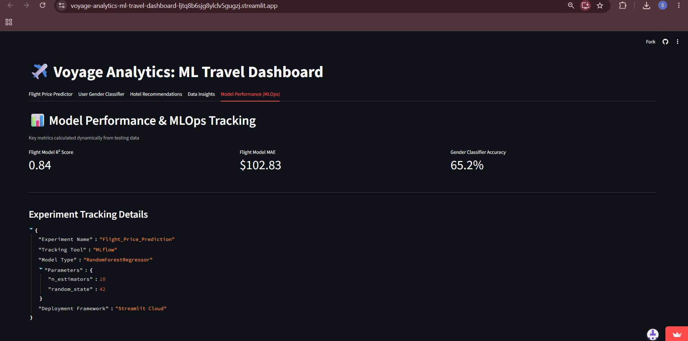

# ✈️ Voyage Analytics: Integrating MLOps in Travel Systems

[](https://voyage-analytics-ml-travel-dashboard-ljtq8b6sjg8ylclv5gugzj.streamlit.app/)
[](https://github.com/SourabhKhamankar22/Voyage-Analytics-ML-Travel-Dashboard)
[](https://www.python.org/)
[](https://mlflow.org/)
[](https://scikit-learn.org/)

---

## 📌 Project Overview

**Voyage Analytics** is an end-to-end Machine Learning and MLOps platform tailored for the travel and tourism industry. By extracting actionable insights from multi-modal travel datasets—spanning flight logs, user demographics, and hotel booking histories—the application delivers real-time price predictions, demographic classification, and destination-based hotel recommendations.

The platform integrates statistical machine learning models with an interactive web dashboard built on Streamlit, managed through MLflow experiment tracking, and hosted live on Streamlit Cloud.

---

## 🔗 Quick Links

* **Live Web Application:** [Voyage Analytics Streamlit Dashboard](https://voyage-analytics-ml-travel-dashboard-ljtq8b6sjg8ylclv5gugzj.streamlit.app/)
* **Source Code Repository:** [GitHub Repository](https://github.com/SourabhKhamankar22/Voyage-Analytics-ML-Travel-Dashboard)

---

## 🚀 Key Features & Modules

### 1. 🛩️ Flight Price Predictor (Regression)
* **Objective:** Predicts real-time flight ticket prices based on key journey attributes.
* **Algorithm:** `RandomForestRegressor`
* **Features Used:** Flight duration (`time`), distance (`distance`), flight cabin class (`flightType`), and airline agency (`agency`).
* **Performance:** $R^2$ Score of **0.84** with a Mean Absolute Error (MAE) of **~$102.83**.

### 2. 👤 User Gender Classifier (Classification)
* **Objective:** Categorizes user demographic profile based on age and corporate affiliation.
* **Algorithm:** `RandomForestClassifier`
* **Features Used:** User age (`age`) and encoded company name (`company`).
* **Preprocessing:** Pre-filtered to exclude non-informative classes (`none`) for clean binary classification.
* **Performance:** **65.2%** Accuracy on real test splits.

### 3. 🏨 Destination Hotel Recommendations (Ranking Engine)
* **Objective:** Suggests the top-ranked hotels for a selected travel destination.
* **Algorithm:** Popularity-Based Recommendation Matrix.
* **Data Source:** Historical aggregated booking frequencies per location from `hotels.csv`.

### 4. 📊 Data Insights & Visualizations
* **Objective:** Explores underlying price trends across flight agencies.
* **Visuals:** Dark-themed distribution plots analyzing pricing ranges across FlyingDrops, CloudFy, and Rainbow agencies.

### 5. 🛠️ Model Performance & MLOps Dashboard
* **Objective:** Tracks dynamic model performance metrics and experiment configurations.
* **Integration:** Logs hyperparameters and evaluation metrics directly via **MLflow**.

---

##  System Architecture

```text
               +----------------------------------+
               |        Travel Datasets           |
               | (flights.csv, users.csv, hotels) |
               +----------------+-----------------+
                                |
                                v
               +----------------------------------+
               |        train_models.py           |
               |  - Data Cleaning & Preprocessing |
               |  - Model Training (RandomForest) |
               |  - MLflow Logging & Artifacts    |
               +----------------+-----------------+
                                |
                   +------------+------------+
                   |                         |
                   v                         v
        +---------------------+   +---------------------+
        |  models/*.pkl File  |   |    mlruns/ (MLflow)  |
        +----------+----------+   +---------------------+
                   |
                   v
        +-----------------------------------------+
        |           streamlit_app.py              |
        |  - Interactive Multi-Tab Interface      |
        |  - Real-Time Inference & Analytics      |
        +--------------------+--------------------+
                             |
                             v
        +-----------------------------------------+
        |        Streamlit Community Cloud        |
        |           (Production Host)             |
        +-----------------------------------------+

```
---
## 📁 Repository Structure
```
Voyage-Analytics-ML-Travel-Dashboard/
├── assets/                     # UI screenshots for project documentation
│   ├── data_insights.png
│   ├── flight_predictor.png
│   ├── gender_classifier.png
│   ├── hotel_recommendations.png
│   └── mlops_performance.png
├── data/                       # Raw input CSV datasets
│   ├── flights.csv             # Flight logs, attributes, and pricing
│   ├── hotels.csv              # Hotel booking logs and destinations
│   └── users.csv               # User profiles, ages, and companies
├── mlruns/                     # Local MLflow tracking logs 
├── models/                     # Trained serialized model artifacts
│   ├── flight_price_model.pkl  # Flight regression model & encoders
│   ├── gender_clf_model.pkl    # Gender classification model & encoders
│   └── hotel_recommendations.csv # Aggregated recommendation table
├── venv/                       # Python virtual environment (Ignored in Git)
├── .gitignore                  # Excluded environment and cache files
├── README.md                   # Project documentation
├── requirements.txt            # Python dependencies
├── streamlit_app.py            # Main Streamlit web dashboard
├── Team_Work_Division.xlsx     # Team task allocation and workload tracking
└── train_models.py             # Offline training & MLflow tracking script
```
---

## 🛠️ Installation & Local Setup Guide
Follow these steps to set up and run the project locally on your machine:
### 1. Clone the Repository
```
git clone [https://github.com/SourabhKhamankar22/Voyage-Analytics-ML-Travel-Dashboard.git](https://github.com/SourabhKhamankar22/Voyage-Analytics-ML-Travel-Dashboard.git)
cd Voyage-Analytics-ML-Travel-Dashboard
```
### 2. Create and Activate a Virtual Environment
- Windows (PowerShell):
```
python -m venv venv
.\venv\Scripts\Activate.ps1
```
- Mac/Linux:
```
python3 -m venv venv
source venv/bin/activate
```
### 3. Install Dependencies
```
pip install --upgrade pip
pip install -r requirements.txt
```
### 4. Train Models & Generate Artifacts
Run the training script to clean the data, log parameters with MLflow, and generate the serialized model files inside the `models/` folder:
```
python train_models.py
```
### 5. Launch the Streamlit Dashboard
```
streamlit run streamlit_app.py
```
Open your browser at `http://localhost:8501` to view the interactive dashboard.

---

## 📂 Dataset Overview
| **Dataset File**  | **Record Count** | **Feature Columns**                                                                                 | **Primary Objective**                          |
| ----------------- | ---------------- | --------------------------------------------------------------------------------------------------- | ---------------------------------------------- |
| **`flights.csv`** | 271,888 rows     | `travelCode`, `userCode`, `from`, `to`, `flightType`, `price`, `time`, `distance`, `agency`, `date` | Train regression model to predict ticket price |
| **`hotels.csv`**  | 40,552 rows      | `travelCode`, `userCode`, `name`, `place`, `days`, `price`, `total`, `date`                         | Build destination hotel recommendation matrix  |
| **`users.csv`**   | 1,340 rows       | `code`, `company`, `name`, `gender`, `age`                                                          | Train demographic classification model         |

---
## 📸 Screenshots & Application Showcase
**1. Flight Price Predictor**
Predicts real-time flight costs based on duration, distance, class, and airline agency.



**2. User Gender Classifier**
Categorizes user demographic profiles based on age and company affiliation.



**3. Hotel Recommendations**
Displays top-rated hotels based on historical booking volumes for any selected location.



**4. Data Insights & Analytics**
Dark-themed boxplots analyzing flight ticket price distributions across different agencies.



**5. Model Performance & MLOps Dashboard**
Displays dynamic evaluation metrics ($R^2$, MAE, Accuracy) and MLflow tracking details.


---

## 📈 Model Evaluation Metrics Summary
```
====================================================================
               VOYAGE ANALYTICS MODEL PERFORMANCE
====================================================================
  1. Flight Price Predictor (RandomForestRegressor)
     - R² Score : 0.84 (Strong Explanatory Power)
     - MAE      : $102.83 (Mean Absolute Error)
  
  2. Gender Classifier (RandomForestClassifier)
     - Accuracy : 65.2% (Tested on clean demographic dataset)

  3. Experiment Tracking
     - Tool     : MLflow
     - Deploy   : Streamlit Community Cloud
====================================================================
```
---

## 👥 Team Members & Role Contributions

This project was developed as a collaborative capstone effort by a 4-member team:

- **Abhinav Reddy** — *Full-Stack ML Engineer & UI Integrator*
  - Designed and built the interactive, multi-tab Streamlit dashboard interface.
  - Integrated all saved `.pkl` model artifacts, encoders, and recommendation tables into Streamlit widgets for real-time inference.
  - Developed the dynamic "Model Performance & MLOps" tab and managed the final cloud deployment on Streamlit Community Cloud.
  
- **Kartik Bingi** — *Lead Data Scientist (Regression & MLflow)*
  - Preprocessed the flight dataset, engineered time and distance features, and applied categorical encoding.
  - Built and tuned the `RandomForestRegressor` to predict real-time ticket prices.
  - Integrated MLflow experiment tracking to log model hyperparameters and evaluation metrics ($R^2$ score and MAE).

- **Kirti Dixit** — *Data Scientist (Classification & Recommendations)*
  - Cleaned the user demographic data, specifically filtering out invalid categories to ensure clean binary classification.
  - Developed and evaluated the `RandomForestClassifier` to predict user gender based on age and corporate affiliation.
  - Designed the popularity-based recommendation matrix to extract and rank the top-rated hotels for any selected travel destination.

- **Sourabh Khamankar** — *Data Analyst & Infrastructure Specialist*
  - Conducted Exploratory Data Analysis (EDA) across flight, hotel, and user datasets to evaluate pricing trends and booking distributions.
  - Built the agency price distribution box plots using Matplotlib and Seaborn, customizing dark-theme visual styling to match the application UI.
  - Configured the virtual environment (`venv`), managed package dependencies in `requirements.txt`, and ensured cross-platform system compatibility.
  ---